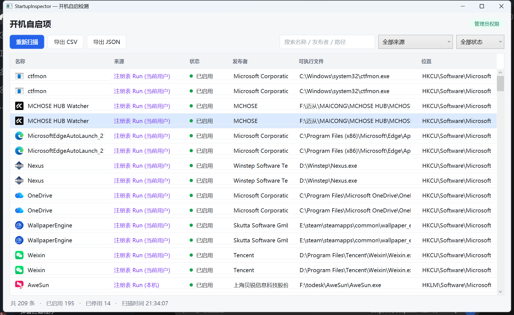

# StartupInspector — Windows 开机自启检测


一个轻量的 Windows 开机自启项查看与管理工具。它会扫描系统上常见的自启位置,
在界面里集中展示,并允许你启用 / 停用 / 删除这些项。



## 下载

到 [Releases 页面](https://github.com/Kanvin7/StartupInspector/releases) 下载 `StartupInspector.exe`:自包含单文件,双击即可运行,无需预先安装 .NET 运行时。
命令行版本是 `StartupInspectorCli.exe`。

> 可执行文件未做代码签名,首次运行时 Windows SmartScreen 可能提示"未知发布者",选择"更多信息 → 仍要运行"即可。

## 功能

- 一键扫描五类自启来源(见下),普通用户即可查看。
- 左侧栏给出总条目 / 已启用 / 已停用 / 最慢一项的读数,状态筛选和"按耗时排序"也在这里。
- 表格展示:程序图标、名称、来源(按类型着色)、状态、开机耗时、发布者、可执行文件;
  选中某一行时,底部会显示它的完整命令行和位置;失效条目(目标文件已不存在)会显示一个警告图标。
- 开机耗时取自 Windows 的"诊断-性能"日志(事件 101/103),需要管理员权限;读不到时该列显示"—"。
- 按名称 / 发布者 / 路径搜索,按来源和状态筛选。
- 启用 / 停用 / 删除选中项,支持多选批量操作;删除前会自动备份,可一键"撤销上次删除"。
- 右键菜单:打开文件所在位置、复制命令行、复制位置。
- 导出为 CSV(带 BOM,Excel 直接打开)或 JSON;导出的是当前筛选后的结果。
- 某个来源整体读取失败时(例如权限不足),状态栏会给出提示,而不是静默当作没有条目。
- 需要修改 HKLM、服务或系统计划任务时,一键"以管理员身份重启"。

## 扫描的自启来源

| 来源 | 位置 |
| --- | --- |
| 注册表 Run / RunOnce(当前用户) | `HKCU\Software\Microsoft\Windows\CurrentVersion\Run(Once)` |
| 注册表 Run / RunOnce(本机) | `HKLM\Software\Microsoft\Windows\CurrentVersion\Run(Once)` |
| 启动文件夹(当前用户) | `%AppData%\Microsoft\Windows\Start Menu\Programs\Startup` |
| 启动文件夹(所有用户) | `%ProgramData%\Microsoft\Windows\Start Menu\Programs\Startup` |
| 应用启动任务(当前用户) | `HKCU\Software\Classes\Local Settings\...\AppModel\SystemAppData\<包族名>\<任务Id>` |
| 计划任务 | 带"登录时 / 开机时"触发器的任务 |
| 系统服务 | 启动类型为"自动 / 自动(延迟)"的服务 |

界面里 Run 与 RunOnce 是两个独立来源。RunOnce 是一次性条目,命令执行后会被 Windows
自行删除,也没有对应的停用开关,因此界面上只能删除它。

注册表会同时枚举 64 位与 32 位视图(即包含 `Wow6432Node`)。两个视图内容不同时
(例如同一程序分别注册在 HKLM 的 64 位与 32 位视图),会显示为两条独立条目,可通过"位置"列区分;
如果某个位置的 32 位视图与 64 位视图指向同一个物理键(例如 `HKCU\Software`),则只显示一遍。

## 各来源的"停用"做法

停用一律采用 Windows 自己的机制,不改动启动项本体:

- 注册表 Run:在 `Explorer\StartupApproved\Run`(32 位项为 `Run32`)写入禁用标记,
  与任务管理器"启动"选项卡的做法完全一致。
- 注册表 RunOnce:不支持停用。`StartupApproved` 下只有 `Run` / `Run32` / `StartupFolder`
  三个子项,没有 RunOnce,而且 RunOnce 条目在命令执行后会被系统删除,所以只能删除它。
- 启动文件夹:在 `Explorer\StartupApproved\StartupFolder` 写入禁用标记,快捷方式文件保留原位;
  `Disabled` 子目录里的快捷方式会当作"已停用"列出,启用时会把文件移回上级目录。
- 计划任务:改为 `Enabled = false` 并重新注册。
- 应用启动任务:写入该项 `AppModel\SystemAppData` 下的 `State` 值(0 = 已停用,2 = 已启用),
  只动当前用户、不需要管理员;这类任务和任务管理器一样只能停用、不能删除。
- 服务:通过 `sc config ... start= disabled` 修改启动类型(需要管理员)。停用后它不再是
  自动启动,重新扫描时不会出现在列表里;原本是延迟启动的服务,重新启用时会保留该设置。

> 停用只改变"是否随开机启动",不会删除启动项本身。如果某个程序每次运行都会重建自己的启动项,
> 停用后需要再次停用,或者直接在该程序自身的设置里关闭"开机启动"。

## 删除与撤销

"删除"是不可逆的,所以每次删除前会先把被删项的原始信息备份到
`%LOCALAPPDATA%\StartupInspector\backups\delete-<时间>.json`:

- 注册表项:值的名称、类型和内容。
- 启动文件夹:快捷方式文件的完整内容。
- 计划任务:完整的 XML 定义。

删除之后可以用工具栏的"撤销上次删除"把最近一次删掉的内容原样建回来,并保留原来的启用/停用状态。
整份备份都还原成功后会被标记,再点一次就是还原更早的那一次删除。服务不会被删除,打包应用的启动任务只能停用。

## 使用

### 图形界面

直接运行 `StartupInspector.exe`。首次启动会自动扫描一次;可用"重新扫描"刷新。

### 命令行(无界面)

```
StartupInspectorCli.exe scan                  # 打印扫描结果
StartupInspectorCli.exe csv  --out items.csv  # 导出 CSV
StartupInspectorCli.exe json --out items.json # 导出 JSON
```

## 目录结构

```
StartupInspector/
├─ StartupInspector.sln
├─ src/
│  ├─ StartupInspector.Core/   # 扫描、启停、模型、导出(可复用)
│  ├─ StartupInspector.App/    # WPF 图形界面
│  └─ StartupInspector.Cli/    # 命令行
└─ tests/
   └─ StartupInspector.Core.Tests/   # 单元测试
```

## 构建

需要 .NET 8 SDK:

```
dotnet build StartupInspector.sln -c Release
dotnet test StartupInspector.sln -c Release
dotnet publish src/StartupInspector.App -c Release -r win-x64 --self-contained true -p:PublishSingleFile=true
```

## 依赖与许可

本项目自身代码以 MIT 许可发布。运行时依赖:

- `TaskScheduler`(dahall,NuGet,MIT)—— 计划任务读写。
- `System.ServiceProcess.ServiceController`(Microsoft,MIT)—— 服务枚举。

设计上参考了以下开源项目,在此致谢:

- StartupPilot(MIT)—— 五来源扫描的划分,以及"各来源禁用约定"的思路。
- p0w3rsh3ll/AutoRuns(BSD-3-Clause)—— 自启位置覆盖的清单参考。

详见 `THIRD-PARTY-NOTICES.md`。

## 许可证

本项目以 [MIT](LICENSE) 许可发布。
